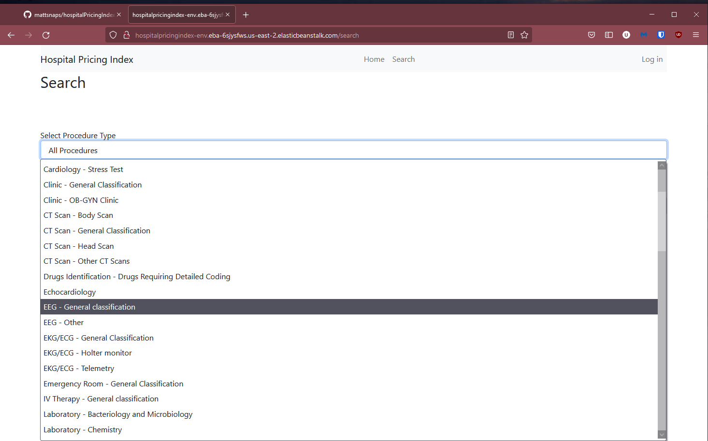

## Search Demo

Select search in the header to go to search page.

Can browse through procedures individually or based on the category they're grouped in.

If browsing by category select the category you want to search 

Category search will return all procedures in that category.

Select a procedure. The Procedure profile page lists the available prices
at different hospitals.

Google scrape api returns links to the top search results for the procedure
as well as top google questions related to the procedure. These results are 
automatically displayed underneath the price comparison.

